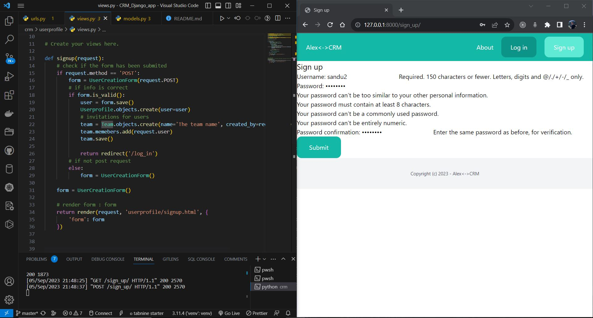

## Customer Relationship Management
-> Customer relationship management (CRM) is a technology for managing all your company's relationships and interactions with customers and potential customers. The goal is simple: Improve business relationships to grow your business.
In this project i create with django-framework, CRM for implements new tehnologies like: Django library, urllib3, requests, sqlparse and Tailwind which is a CSS framework. I start thi app with write step-by-step whrite the todolist.txt where you can find all the stages of the project.
## Installation packages

 Create a vitual enviroment for this project: python -m venv //name of venv// and after you must to install next packages from requirements file.
 In terminal run this cmd: pip install -r requirements.txt
 In requirements you will find all packages with latest version for this app which are:
- asgiref==3.7.2
- certifi==2023.5.7
- charset-normalizer==3.1.0
- Django==4.0.10
- django-cors-headers==4.1.0
- djangorestframework==3.14.0
- idna==3.4
- pytz==2023.3
- PyYAML==6.0
- requests==2.31.0

## Start Project
### Create core app
- The core app will be create for CRM pages -> (python manage.py startapp core). In this app are templates folder with html file for pages(about, base, index).html for simple and basics view of the project. 
- For to create html files i use techologies from Tailwind CSS ,is a utility-first CSS framework designed to enable users to create applications faster and easier.
- The base.html templates i used in evrey html files for to build the pages as efficiently as possible and use the same footer and header on the page, to use the code from index.html in base.html I used snippet code that includes a block called In Django, templates use the concept of blocks to define placeholder content that can be overridden in child templates.
- In views.py file i define functions for about and index html files from templates, after that i put the name of app in INSTALLED_APPS in settings.py. This path is a list of strings designating all applications that are enabled in this Django installation. 
- In models.py i code the "Client" model which is designed to represent individual clients or customers associated with a specific team in a crm application. Each client has a name, email address, and an optional description. The model keeps track of who created the client and when it was created or last modified. 
- To use this model, you need to run migrations to create the corresponding database table. After that, you can interact with the Client model using Django's ORM (Object-Relational Mapping) to perform CRUD operations (Create, Read, Update, Delete) on the database.
- I create superuser for administration this app -> python manage.py createsuperuser, and set user: admin, email: admin@gmail.com and passw: admin
- With python shell (python manage.py shell) i create userprofile for register other people who want to enter in login interface of administration the crm app. In aadmin.py i register userprofile in administration interface of django-framework (admin.site.register(Userprofile)), and after we have Userprofile object in list of useprofiles
### Create userprofile app (auth)
- In this app i set the signup, login_required decorator, create another html file for view.py functions for call from urlpatterns adress the html file for confirmation the signup functionality. In sign-up.html i put tags whci are used for templates inheritance with other html template files. 
- The signup function i POST the form from user after created, i used the request method for form and afetr with if statement which is used for conditional execution, when a form is submitted, you typically validate the data using form.is_valid() and then save the form data to the database.In final the function return render html file (login.html) for authentification user and you can logout from crm page.
### Create app Lead
- This app i create for add new leads and after that we have posibilities for update the data from evrey created lead with (CRUD) techology
- In lead/models.py which is Django model, defines a data structure to store lead information, including name, email, description, priority, status, team association, creator user, and timestamps for creation and modification. The ForeignKey fields establish relationships with other models to create a well-structured CRM system for managing leads.
- After create the model for lead, i made migrations to database and create dbsqlite3
- For create a new lead you must acces localhost/admin and in lead category you find the configurator for create, after you will see the new lead in the Leads list. 
- view.py file handles lead-related operations, such as listing leads, displaying lead details, editing leads, adding new leads, deleting leads, and converting leads to clients. The functions use Django's built-in messages framework to display success messages after certain actions are performed.
- Django URL configuration (urls.py) is for the lead app, which maps the URL patterns to the corresponding view functions in the views.py file.

### Create app Client
- This app convert leads to client, change and delete clients
- models.py is the same with lead/models.py, just change class name and we have a same functionality for create a new client. The clients_edit view function handles the editing of a client's information. 
- The view uses the AddClientForm form class to handle the editing of client information. The form is initialized with the request.POST data if the request method is POST, and it is initialized with the client's current data if the request method is not POST.
- If the request method is POST, the view checks if the submitted form data is valid (form.is_valid()). If the form data is valid, it saves the changes to the client using form.save(). After successful saving, a success message is displayed using Django's messages framework.
- Finally code display a success message using Django's messages framework that the client was converted

### Create app team
- This is the last app, when you create team make sure team is set, create a lead make sure team is set.

## TestCases
- A test case is a singular set of actions or instructions for a tester to perform that validates a specific aspect of a product or application functionality. If the test fails, the result might be a software defect that the organization can triage.
-  In this project compartment we used testcases to check the response of the function calls created in the models and view files. To check the code I used assertions for to verify that the actual outcomes of test cases match the expected outcomes. When writing test cases, i set up specific scenarios and actions, and then you use assertions to check if the results of those actions are as expected.
- For example in team app i tested models functions ,file is used to define the database schema and data model for the application. First i define a TestModel class with setup and test_plan_atributes functions, in setup i create name, descriptions and other data for create a team and in the next function with assertions, the test program performed the data comparison.
## Dockerization
Dockerizing is the process of packing, deploying, and running applications using Docker containers. Docker is an open-source tool that ships your application with all the necessary functionalities as one package.
- For this step i create Dockerfile and docker-compose.yml file for to define the environment and instructions for building a Docker container. 
- This Dockerfile sets up a Python environment, installs the required Python packages, copies the application code, and specifies the command to run the Django development server. To build and run the Docker container, you can use Docker commands like docker compose build and docker compose up.

#### Fig.1 Add clients if we have limit num

#### Fig.2 My account dashboard

#### Fig.3 ASigh-up view
